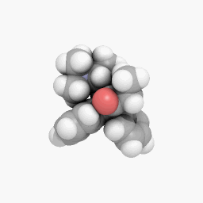

# What is this?

A Machine Learning Computational Chemistry Development Environment

What is Included?

* [RDKit](https://www.rdkit.org/)
* Conda
* [Fortran](https://fortran-lang.org/) 
* Vim
* Conquerer of Code


# chem-dev Docker Instructions

Start container with -p 8888:8888 flag if Jupyter Notebook is intended. 

source activate my-rdkit-env

conda install -c conda-forge --file requirements.txt

To run notebook from within container: 

jupyter notebook --port=8888 --no-browser --ip=0.0.0.0 --allow-root


## Tools 

* RDKIT
* [DeepChem](https://github.com/deepchem/deepchem) == 2.3.0


## Computational Chemistry

 

> "Among the main tasks of computational chemistry are to determine the
structure and energy of molecules and of the transition states involved in
chemical
reactions: our “structures of interest” are molecules and the transition states
linking
them."

> "The potential energy surface (PES) is a central concept in computational chemistry.
A PES is the relationship – mathematical or graphical – between the energy of a
molecule (or a collection of molecules) and its geometry."

> "Geometry optimization is the process of starting with an input structure “guess”
and finding a stationary point on the PES."

The main tools of Computational Chemistry:

* Molecular mechanics – based on a ball-and-springs model of molecules - fast
* Ab initio methods – based on approximate solutions of the Schrodinger equation
without appeal to fitting to experiment - gives energy and wavefunction, slow
for large molecules, 
* Semiempirical methods – based on approximate solutions of the Schr€odinger
equation with appeal to fitting to experiment (i.e. using parameterization
- plugging in experimental values to get best calculated values) - slower than
  molecular mechanics, much faster than ab initio
* Density functional theory (DFT) methods – based on approximate solutions of the
Schrodinger equation, bypassing the wavefunction that is a central feature of
ab initio and semiempirical methods
* Molecular dynamics methods study molecules in motion - allows chemical
  reations to be simulated

> "The principle behind MM is to express the energy of a molecule as a function of
its resistance toward bond stretching, bond bending, and atom crowding, and to
use
this energy equation to find the bond lengths, angles, and dihedrals
corresponding to
the minimum-energy geometry – or more precisely, to the various possible
potential
energy surface minima"

## Interesting Projects

[MiniFold](https://github.com/hypnopump/MiniFold)

[AlphaFold CASP-13](https://github.com/deepmind/deepmind-research/tree/master/alphafold_casp13)

[FermiNet](https://github.com/deepmind/ferminet) - From DeepMind 


## Fortran 

Fortran is the language of Quantum Chemistry and Solid state physics.
The reason being projects like [LAPACK](http://www.netlib.org/lapack/). Fortran
is not going anywhere, anytime soon, as the inclusion in the
[Magma](http://icl.cs.utk.edu/projectsfiles/magma/doxygen/) project can attest. 
Understanding Fortran will take you far in in the QC game.

Hello Word: hello.f90

```fortran

program hello

  implicit none ! explicit declaration of all variables 
  character*20 :: world
  print *, "Hello?: "
  read *, world
  print *, "Hello, ", world 

end program hello 
```

```fortran

program hoopGenerator
  
  implicit none
  character (len = 20) :: city, avatar
  print *, "What is the best basketball city in the world -> Brooklyn"
  read *, city
  print *, "What is the best basketball team name? -> Nets" 
  read *, avatar 
  print *, "best basketball team is the: ", trim(city), " ", trim(avatar)

end program hoopGenerator

``` 
  

